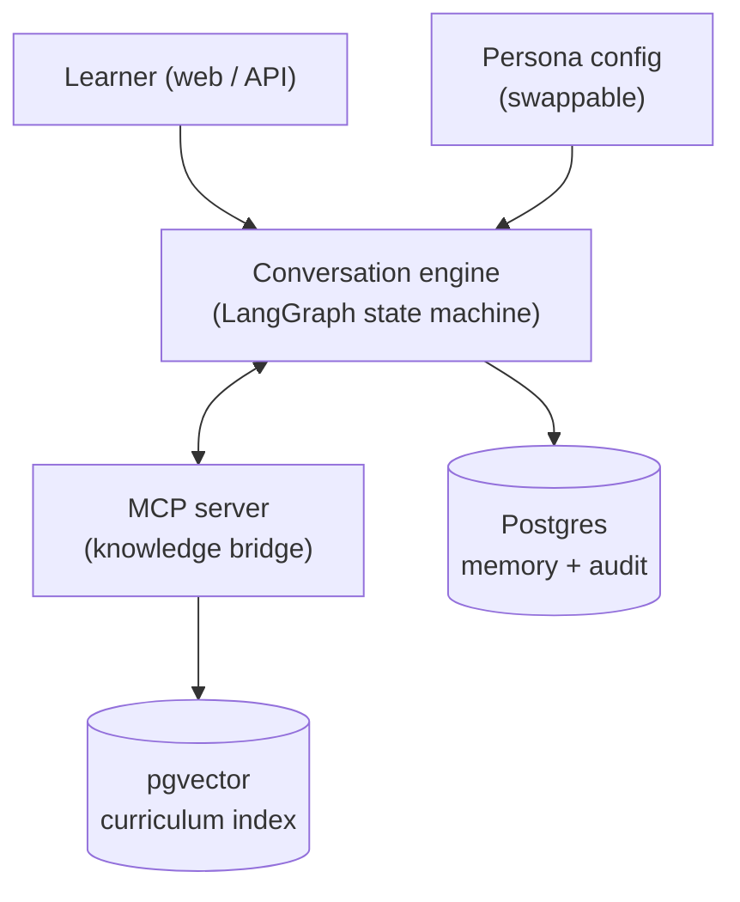

# Cumulus architecture (short version)

Cumulus is a **culturally- and personally-responsive mentor bot** built on a
production RAG + agent architecture. It answers strictly from a real
cloud-architecture curriculum and cites the exact lesson behind every claim.

## The shape

## Core principles

1. **Guided interview with a deterministic spine** — a LangGraph state machine, not a free-form chatbot. The graph supplies structure; the model supplies language.
2. **Grounded answers only** — retrieve, cite the source lesson, and say "I don't have enough information from the curriculum" rather than guess.
3. **Structured facts vs. generative language** — anything that must be exact comes from data; the model only explains, it never invents facts.
4. **Corrective RAG** — grade retrieval quality; re-query or refuse when it's weak (capped).
5. **Persona = config, not code** — add new mentors (specialty, language, tone, voice) without touching the engine, tools, or retrieval.

## Stack choices (and why)

- **LangGraph** for orchestration: the graph *is* the conversation map; the Postgres checkpointer gives durable memory + audit for free.
- **pgvector** for the vector store: one database for app data, memory, audit, and vectors. Under a few million chunks it's the correct production choice, not a starter. Retrieval sits behind one function, so graduating to a dedicated vector DB later is a single-file change.
- **MCP server** as the knowledge bridge: reusable, independently testable, and front-end-agnostic.

## The property this demonstrates

> It only answers from the actual curriculum, and every answer cites the exact module — no hallucinated cloud advice.
